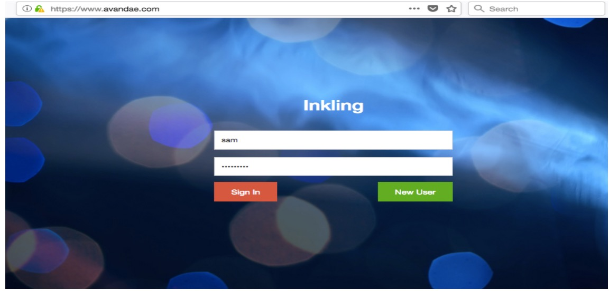
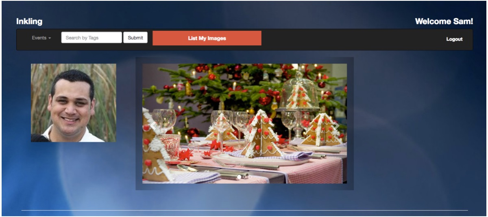
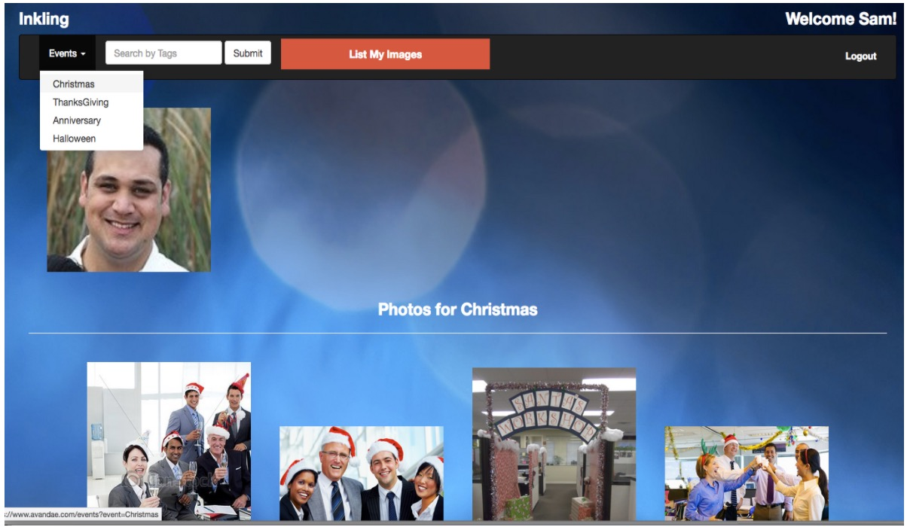
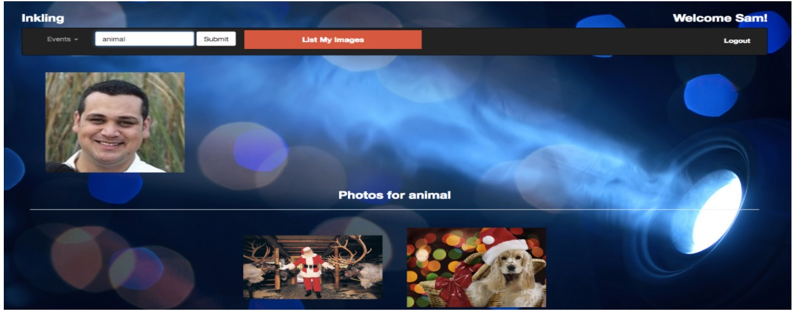
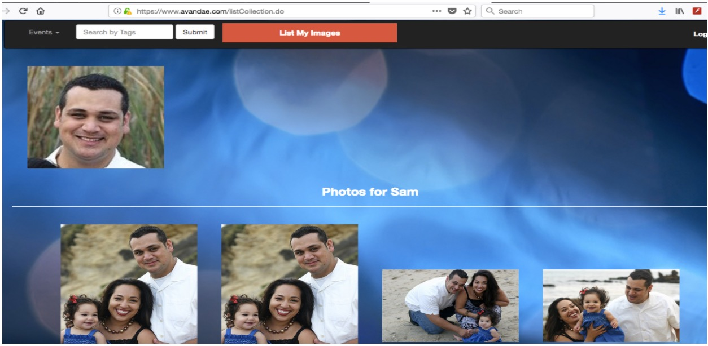

# Inkling

    University Name: http://www.sjsu.edu/
    Course: Cloud Technologies
    Professor: Sanjay Garje
    ISA: Divyankitha Urs
    
## Group Number 04:
    
    • Anjana Eldo (https://www.linkedin.com/in/anjana-eldo-1b7744146/)
    • Anjana Kamath Miyar (https://www.linkedin.com/in/anjanakamath/)
    • Mudrita Chaturvedi  (www.linkedin.com/in/mudrita-chaturvedi-aa844588)
    • Vidya Coimbatore Nand Kumar (www.linkedin.com/in/vidya-n-)
    

## About Us:

Inkling is an online photo management application designed and deployed on AWS cloud that lets users manage and access their photos based on events/tags.

## Features offered:

    • Voice message welcoming the user on successful authentication
    • Filter the images based on events
    • Search for event pictures based on keywords
    • The user may access all of his photos from various events
    • Voice commands to access photos based on tags

## Pre-requisites for running this project on local

###  Softwares that needs to be installed:
    • Java downloaded and installed on local machine
    • Maven downloaded and installed on local machine
    • Apache tomcat downloaded and installed on local machine
    • Node and npm downloaded and installed on local machine
    • Git downloaded and installed

### Cloud Resources that needs to be created before running this application on local machine

    • S3 bucket with s3 transfer acceleration enabled.
    • Cloudfront for the S3 bucket that is created.
    • MYSQL RDS server with single AZ for database
    • IAM user that has get/put/delete access on the bucket created.
    • Rekognition : To detect labels to identify and tag the objects and compare the images in collection with S3 for facial recognition.
    • DynamoDB : To store image labels and commands spoken by the user to alexa.
    • Lambda : To update the DynamoDB and send response to Alexa device
    • API Gateway: To access the lambda function and return the value retrieved from the database.

## Running the project from local

    • Download or clone the project on your local machine.
    • Go to the directory containing pom.xml file.
    • Give command mvn clean install
    • Next give command mvn spring-boot:run
    • Go to localhost:8080 to see your website running.
    
## Login Page

    
    
## Dashboard window

    
    
##  Search by Event

    
    
## Search by Label

    
    
## Search by face

